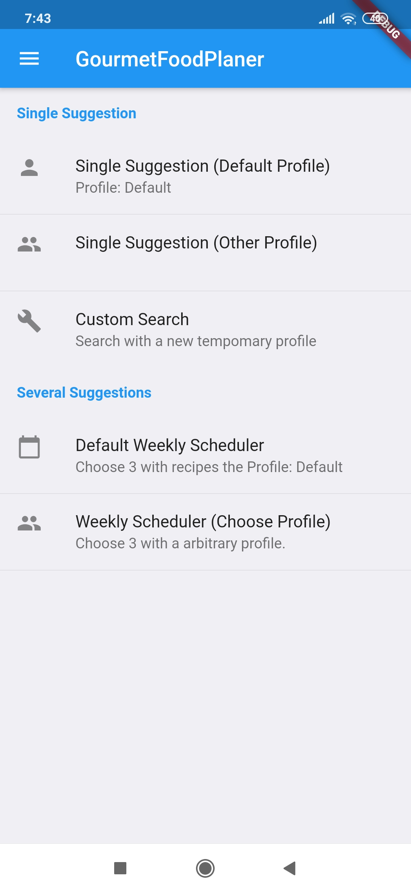
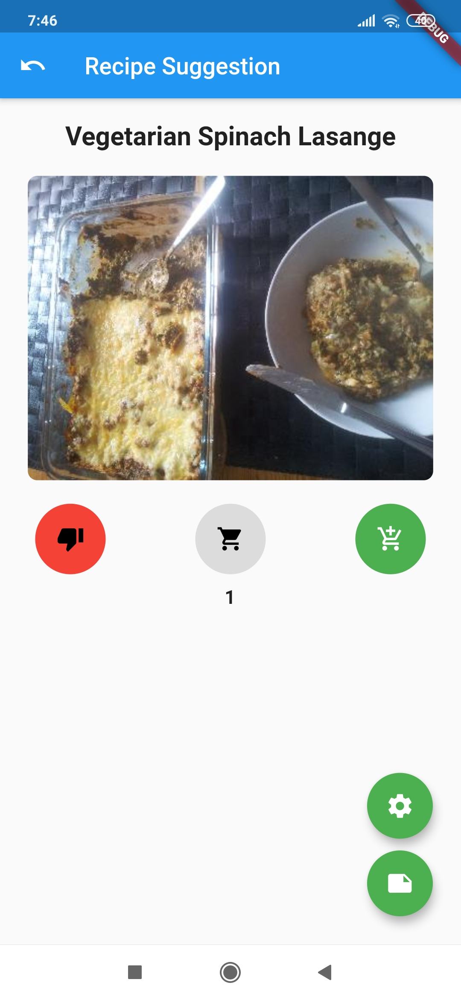
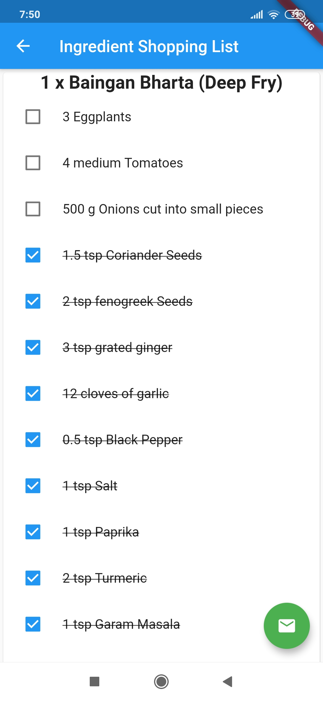
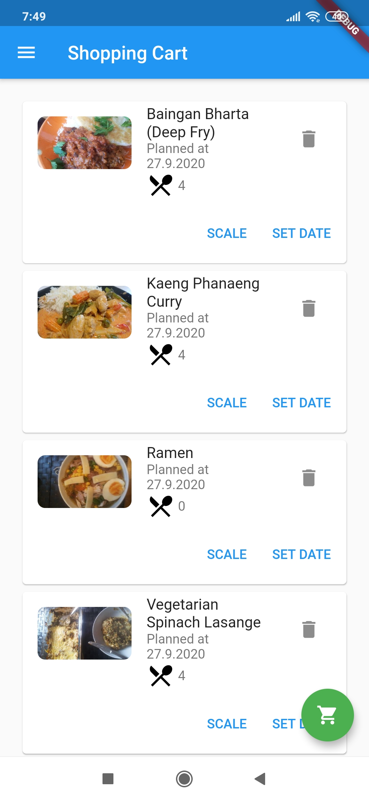

### GourmetFoodPlaner
The intention of this app is to be a mobile support for *Gourmet Recipe Manager* (https://thinkle.github.io/gourmet/). A core aspect of this is the planning of shopping, including suggesting dishes, compiling and creating lists of ingredients that can be sent by e-mail.
The app currently uses a copy of the recipe sql database on the SD card. The specific path is displayed within the app.

### How to install this app
#### Prebuild Binary
For quick testing purposes there is a built apk file, which is not intended for production use. 

**Don't report any bug in the test test apk!**

[Download Test APK (v1.0.3)](prebuild_binary/app-debug.apk)

#### Nightly Build
You can build this project via flutter and *Android Studio*.
Install Android Studio connect your smartphone via usb and install the app. A real release version does not exist yet.

### Notes from the Developer

Since I haven't had much time to develop the app lately, I make it available here.
The app is still in a development version.
There are still a few open points, which I haven't been able to reach lately:

- create an app icon
- license selection
- build a release version
- publish app via *F-Droid* (https://www.f-droid.org/) as an open source app
- Fix some minor bugs
- implement some kind of update of the recipes database over the internet

Feel free to contact me, if you have questions or want to support this project.

Contact Info: Developer.GourmetFoodPlaner@web.de

## Images of the App

### Credits
**Launcher Icon**

- Icons made by [Freepik](https://www.flaticon.com/authors/freepik "Freepik") from [www.flaticon.com](https://www.flaticon.com/ "Flaticon")
